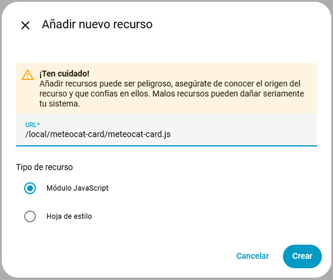
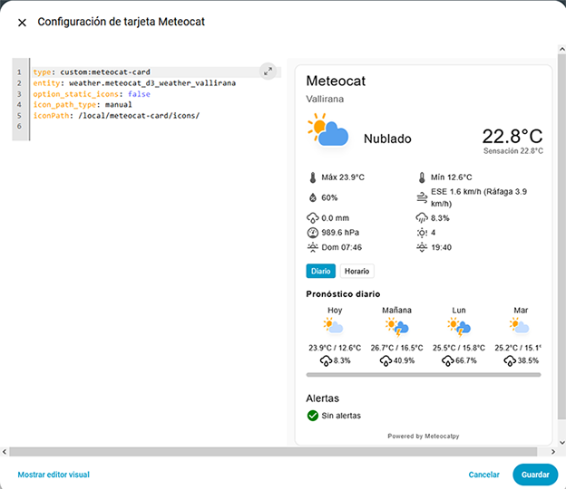
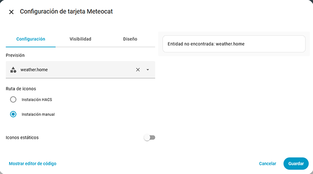
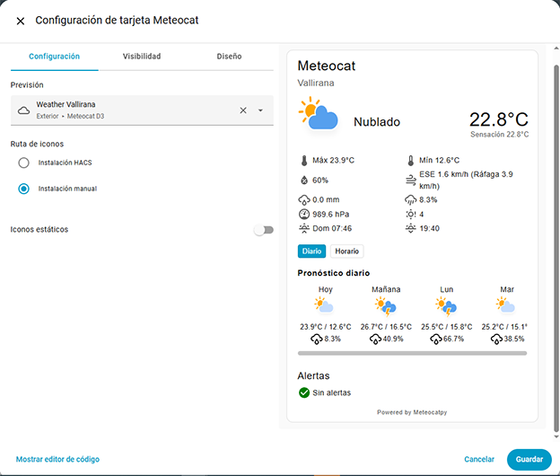
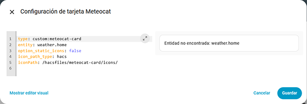
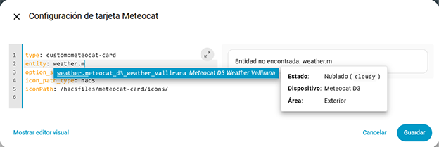
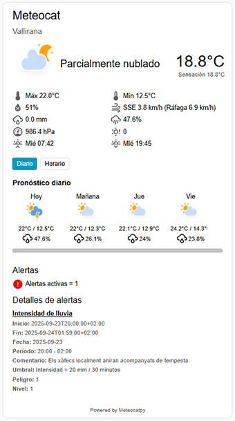
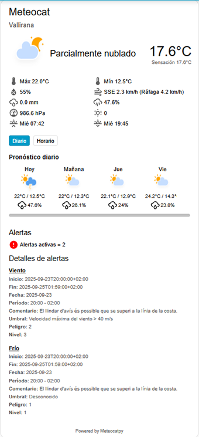

# 🌤️ Meteocat Card

[](https://opensource.org/licenses/Apache-2.0)

[](https://github.com/hacs/plugin)
[](https://github.com/figorr/meteocat-card/actions/workflows/validate.yaml)
[](https://github.com/figorr/meteocat-card/actions/workflows/release.yml)


Custom Lovelace card for Home Assistant to display weather data from the [Meteocat integration](https://github.com/figorr/meteocat).  
Supports animated or static icons with day/night variants, and shows hourly and daily forecasts.

## Installation

### HACS (From the Store)

1. Open **HACS**.  
2. Search for **Meteocat Card** and install it.
3. Refresh the Lovelace

### Manual
1. Download the `meteocat-card.zip` file from the latest release. 

2. Unzip the file.

3. Copy the compiled file `meteocat-card.js` and `meteocat-card-editor.js` to your Home Assistant `www` folder, preferably in a subfolder for organization:
   
   ```text
   /config/www/meteocat-card/meteocat-card.js
   /config/www/meteocat-card/meteocat-card-editor.js
   ```

4. Place the icon SVGs that are located in /www/meteocat-card/icons into your Home Assistant setup at:

   ```text
   /config/www/meteocat-card/icons/
   ```

5. Add the resource to your Lovelace configuration:

   Go to **Settings > Dashboards > Resources > Add Resource**

   ```yaml
   url: /local/meteocat-card/meteocat-card.js
   type: module
   ```

   

   

   

6. Refresh or hard refresh your web browser.

   #### To perform a refresh
   ##### - On Windows and Linux
   - Ctrl + F5
     : This is the universal shortcut for a hard refresh in most browsers. 
   - Ctrl + Shift + R
     : This is another common shortcut for a hard refresh. 
   - Ctrl + Click the Reload Button
     : You can hold the Ctrl key and click the browser's reload icon to achieve the same result.

   ##### - On Mac
   - Command + Shift + R
     : For Chrome, Firefox, and Edge, use this shortcut to force a refresh. 
   - Shift + Click the Reload Button
     : In Safari, you can hold the Shift key and click the reload icon to bypass the cache. 
   - Command + Option + E then Reload
     : For a hard refresh in Safari, first press Command + Option + E to empty the cache, then click the Reload button in the toolbar.  

## Icon Path Setup

The card needs to know the path to its custom icons. The path depends on how you installed the card, by default HACS installation.

So if you are using the visual editor you can pick **manual** or **HACS intallation**, the card will set the proper icon path.

In case you are using code editor, the **HACS installation icon path** is the option set by default.

You can edit the icons path if you placed the icons in a different place. You have to edit **iconPath**: `iconPath: /hacsfiles/meteocat-card/icons/`

### Manual installation:

`/local/meteocat-card/icons/`

or which is the same:

`/config/www/meteocat-card/icons/`

### HACS installation:

`/hacsfiles/meteocat-card/`

#### Visual editor example


#### Code editor example



## Icon Setup

- a- prefix → animated icons (e.g., a-clear-day.svg)
- s- prefix → static icons (e.g., s-clear-day.svg)
- -day suffix → daytime icon
- -night suffix → nighttime icon
- clear-night ignores the day/night suffix

Example icons:
```css
a-clear-day.svg
a-clear-night.svg
s-rainy-day.svg
s-rainy-night.svg
```

## Configuration

### Pick the card

   

### Using your Meteocat Weather Entity

   Use your Meteocat Weather entity to get full functionality including current conditions, hourly and daily forecasts.

   You can use **visual editor** and **code editor** to configure your card.

   #### (a) Visual editor setup

   - The visual setup is an easy way to configure your card.

      #### Visual editor example

      

      

      

   - And **save**

   - Sometimes the alerts are not inmediately being shown so you need to perform a refresh at your lovelace or web browser, as explained above.

   #### (b) Code editor setup

   ```yaml
   type: custom:meteocat-card
   entity: weather.home
   option_static_icons: false  # set true for static icons
   icon_path_type: hacs
   iconPath: /hacsfiles/meteocat-card/
   debug: false
   ```

   - entity: Your Meteocat Weather entity (e.g., weather.meteocat_yourtown)
   - option_static_icons: true for static icons, false for animated icons

     The card automatically selects the correct icon based on the current condition and time of day.

      #### Code editor example

      

      

      

      ```yaml
      type: custom:meteocat-card
      entity: weather.meteocat_station_id_weather_town_name
      option_static_icons: false
      icon_path_type: manual
      iconPath: /local/meteocat-card/icons/
      debug: false
      ```

   **The card shows:**

   - Current weather condition and icon
   - Temperature, humidity, pressure, wind speed, bearing, gust, precipitation, precipitation probability, uv index, sunset* and sunrise*
   - Daily forecast
   - Hourly forecast

## Configuration Options

| Option               | Type    | Default                          | Description                                            |
|----------------------|--------|-----------------------------------|--------------------------------------------------------|
| `entity`             | string | —                                 | **Required.** Your Meteocat weather entity.            |
| `option_static_icons`| boolean| `false`                           | Use static icons (`true`) or animated icons (`false`). |
| `icon_path_type`     | string | `hacs`                            | Use `hacs` or `manual` according to your installation. |
| `iconPath`           | string | `/hacsfiles/meteocat-card/`       | Path to the folder containing the SVG icons.           |
| `debug`              | boolean| `false`                           | Use `true` to enable debug.                            |

## Notes

- Make sure your Meteocat integration provides a Weather entity (not just individual sensors) to get full card functionality.
- The card dynamically determines day or night icons.
- For best results, keep your icons folder updated with the latest icons from the repo.

## Examples

### Basic Usage

```yaml
type: custom:meteocat-card
entity: weather.meteocat_station_id_weather_town_name
option_static_icons: false
icon_path_type: hacs
iconPath: /hacsfiles/meteocat-card/
debug: false
```

### Using Animated Icons

```yaml
type: custom:meteocat-card
entity: weather.meteocat_station_id_weather_town_name
option_static_icons: false
icon_path_type: hacs
iconPath: /hacsfiles/meteocat-card/
debug: false
```

### Using Static Icons

```yaml
type: custom:meteocat-card
entity: weather.meteocat_station_id_weather_town_name
option_static_icons: true
icon_path_type: hacs
iconPath: /hacsfiles/meteocat-card/
debug: false
```

### Example Display

#### Current Weather:

(a) No alerts


(b) 1 alert



(c) 2 alerts



#### Daily Forecast:


#### Hourly Forecast:


## Features

- ✅ Display temperature, humidity, wind speed, and precipitation among other
- ✅ Shows a weather icon according to the condition and time of day
- ✅ Supports animated (a-) or static (s-) icons
- ✅ Displays hourly and daily forecasts when using a Weather entity
- 🚧 Lightweight and compatible with Home Assistant 2025+
- 🛠️ Early stage — more features will be added (styling, additional forecasts, etc.)

## Uninstalling Meteocat Card

To remove the Meteocat Card follow the guidelines from Wiki [Uninstallation](https://github.com/figorr/meteocat-card/wiki/Uninstallation)

## Troubleshooting

FAQ and common issues are solved in the Wiki.

Please take a look at [Troubleshooting](https://github.com/figorr/meteocat-card/wiki/Troubleshooting)


## Contributing to Meteocat Card

Thanks for your interest in contributing! 🚀

We welcome contributions in any form: bug reports, new features, or improvements to documentation.

### How to Contribute

1. **Check existing issues and discussions**  

   See if your idea or bug has already been reported:
   - [Issues](https://github.com/figorr/meteocat-card/issues)
   - [Discussions](https://github.com/figorr/meteocat-card/discussions)

2. **Fork the repository**  

   Click the "Fork" button at the top-right of this repository.

3. **Set up your development environment**

   ```bash
   git clone https://github.com/YOUR_USERNAME/meteocat-card.git
   cd meteocat-card
   npm install
   ```

4. **Start developing**

- The main code is in src/meteocat-card.js.
- The editor code is in src/meteocat-card-editor.js
- You can use a local dev server (e.g., npm run watch) to see changes live in Home Assistant.

5. **Lint and test your code**

     ```bash
     npm run lint
     npm run test
     ```

     Make sure your code passes linting and tests before committing.

6. **Add yourself to `AUTHORS.md`.**

7. **Update `README.md`.** 

     Just update the `README.md` with any new documentation if your development includes new features for the card.

7. **Commit your changes**

     ```bash
     git add .
     git commit -m "feat: describe your change"
     git push origin your-branch
     ```

8. **Submit a Pull Request**

- Open a PR from your branch to the master branch of this repository.
- Describe your changes clearly and link any relevant issues.

## Code Style

- Use ES6+ syntax.
- Prefer const/let over var.
- Keep code modular and readable.
- Follow Prettier formatting (if configured).

## License

[Apache-2.0](LICENSE). By providing a contribution, you agree the contribution is licensed under Apache-2.0.
